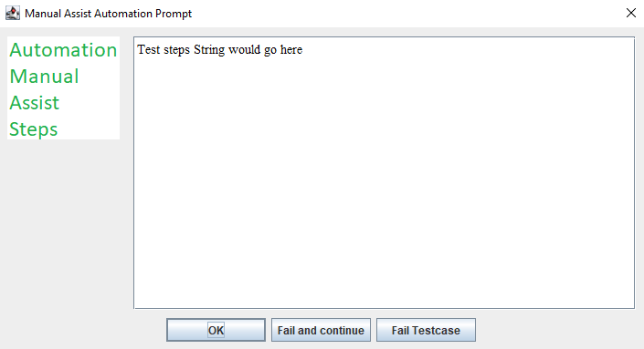

# ManualAssistDialog

The idea here is to provide a simple way to prompt a manual tester to perform manual test steps during an automated test run.
The test automation can do all the setup necessary for a test, and then display a GUI dialog prompting the person
running the test automation to manually perform steps via the application GUI, and then click on one of several buttons to indicate what should happen next.
The test automation can then continue executing, performing additional actions such as verifications or setting the test status based on the returned status code.

This self executing Java application can be called from your test automation code and will allow you to prompt the user to perform manual test steps. 
Send a string to the application with the steps you want displayed in the text area.

The manual tester will then click on one of several buttons to indicate what should happen next.

A status code is returned to the calling application.
	     * 0 = Test Passed button selected
	     * 1 = Test Failed, but continue button selected
	     * 2 = Test Failed, stop executing button selected
	     * 3 = No button selected, user closed window.

Upon receiving the return code your test automation code can perform additional actions such as verifications or just set the test status based on the returned status code.

Because this is a Java application it will work on all platforms that support Java.

JDK 21 LTS

## Example Usage
```java -jar MaDialog.jar "Test steps String would go here" ```

Example Screen Shot:

